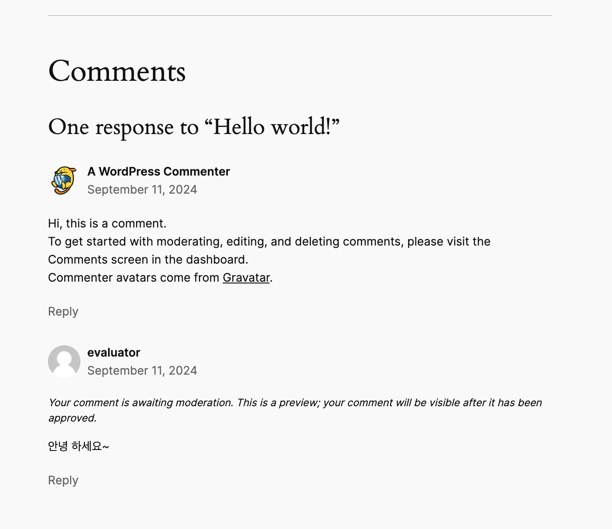

> # 🐳 inception

docker, docker-compose 를 사용하여 Nginx, MariaDB, WordPress 세가지 컨테이너를 구성하고, Docker 네트워크를 통해 서로 통신할 수 있는 환경 구성하기.


## 🛠 설치 및 실행 방법

### 1. 클론 레포지토리 및 루트 디렉토리로 이동

```shell
git clone https://github.com/GCgang/inception.git && cd inception
```

### 2. 프로젝트 빌드 및 실행

```shell
make
```

### 3. Docker 컨테이너 상태 확인

```shell
docker ps
```

### 4. 각 컨테이너 네트워크 연결 상태 확인

```shell
docker network instpec our_net
```

### 5. 볼륨 확인

```shell
docker volume ls
```

<br>

## 테스트 과정

### 1. `docker ps` 결과 확인하기

```shell
❯ docker ps
CONTAINER ID   IMAGE                 COMMAND                   CREATED          STATUS          PORTS                  NAMES
9f95c8f0b1db   wordpress:inception   "dumb-init -- /usr/l…"   15 minutes ago   Up 15 minutes   9000/tcp               wordpress
d2cdcfc3a198   nginx:inception       "dumb-init -- nginx …"   15 minutes ago   Up 15 minutes   0.0.0.0:443->443/tcp   nginx
1bf625575e05   mariadb:inception     "dumb-init -- /usr/l…"   15 minutes ago   Up 15 minutes   3306/tcp               mariadb

```

- 스크립트 파일에서 설정한 COMMAND를 사용하여 실행 중 인것을 알 수 있다.
- Nginx는 0.0.0.0:443->443/tcp로 외부 443 포트와 연결되어 있는 것을 확인할 수 있다.(443포트에서 들어오는 요청을 Nginx 컨테이너의 443 포트로 전달)
- WordPress는 내부적으로 9000/tcp 포트를 사용하고 있는 것을 알 수 있다.(외부 포트와 매핑되지 않았기 때문에 Nginx에서 워드프레스로 프록시 처리를 해준다.)
- MariaDB는 내부적으로 3306/tcp 포트를 사용하고 있는 것을 알 수 있다.(외부에는 노출되지 않고 WordPress 컨테이너가 이 포트를 통해 MairaDB와 통신한다.)

### 2. `docker network inspect our_net` 결과 확인하기

```shell
❯ docker network inspect our_net
[
 {
     "Name": "our_net",
     "Id": "cdc5635a6238a84b0b3aadfa899529011403ef19eac280d388714dee922ef863",
     "Created": "2024-09-11T02:07:15.261209255Z",
     "Scope": "local",
     "Driver": "bridge",
     "EnableIPv6": false,
     "IPAM": {
         "Driver": "default",
         "Options": null,
         "Config": [
             {
                 "Subnet": "172.18.0.0/16",
                 "Gateway": "172.18.0.1"
             }
         ]
     },
     "Internal": false,
     "Attachable": false,
     "Ingress": false,
     "ConfigFrom": {
         "Network": ""
     },
     "ConfigOnly": false,
     "Containers": {
         "1bf625575e05c7e5be5d94fd5e5e175f552f06afd633f29fe0fd889940934b71": {
             "Name": "mariadb",
             "EndpointID": "9fd419b8aa921cda9635c03423fd0e310be211f1643c14f4b8d58da51f904204",
             "MacAddress": "02:42:ac:12:00:02",
             "IPv4Address": "172.18.0.2/16",
             "IPv6Address": ""
         },
         "9f95c8f0b1dbabc3ddd694d76e69ccf95c00d80ed6e4080abfc9f54e8d2c3804": {
             "Name": "wordpress",
             "EndpointID": "c1730d4efdb9b8138b61512a926157a75e6e79804d0cf30a740905e89b190a4d",
             "MacAddress": "02:42:ac:12:00:04",
             "IPv4Address": "172.18.0.4/16",
             "IPv6Address": ""
         },
         "d2cdcfc3a19817170b47af9636e7240a7a16be814d3d7566deeb47ef6ec2475d": {
             "Name": "nginx",
             "EndpointID": "766f297fb332fbf3f72d10a573733c940e7571bbe9b053579946c52e86fa7cce",
             "MacAddress": "02:42:ac:12:00:03",
             "IPv4Address": "172.18.0.3/16",
             "IPv6Address": ""
         }
     },
     "Options": {},
     "Labels": {
         "com.docker.compose.network": "our_net",
         "com.docker.compose.project": "srcs",
         "com.docker.compose.version": "2.26.1"
     }
 }
]

```

- Name: 네트워크 이름이 our_net 이라는 것을 확인할 수 있다.
- Driver: bridge로 설정되어 있어, 각 컨테이너는 이 네트워크를 통해 통신할 수 있다는 것을 확인할 수 있다.
- Subnet: 172.18.0.0/16 서브넷을 사용하고 있고, 이 서브넷 내에서 IP 주소가 할당 된다.
- Containers: 네트워크에 연결된 컨테이너 정보를 확인할 수 있다.
  - mariadb(IPv4Address: 172.18.0.2/16)는 172.18.0.2 IP 주소를 가지고 있다.
  - wordpress(IPv4Address: 172.18.0.4/16)는 172.18.0.4 IP 주소를 가지고 있다.
  - nginx(IPv4Address: 172.18.0.3/16)는 172.18.0.3 IP 주소를 가지고 있다.
- 모든 컨테이너는 172.18.0.0/16 서브넷 내의 고유한 IP 주소를 가지고 브리지 네트워크에 연결되어 서로 통신할 수 있음을 확인할 수 있다.

### 3. `docker volume` 결과 확인하기

```shell
❯ docker volume ls
DRIVER    VOLUME NAME
local     srcs_mariadb_data
local     srcs_wordpress_data
❯ docker volume inspect srcs_mariadb_data
[
 {
     "CreatedAt": "2024-09-11T02:07:15Z",
     "Driver": "local",
     "Labels": {
         "com.docker.compose.project": "srcs",
         "com.docker.compose.version": "2.26.1",
         "com.docker.compose.volume": "mariadb_data"
     },
     "Mountpoint": "/var/lib/docker/volumes/srcs_mariadb_data/_data",
     "Name": "srcs_mariadb_data",
     "Options": {
         "device": "/Users/jun/data/mysql",
         "o": "bind",
         "type": "none"
     },
     "Scope": "local"
 }
]
❯ docker volume inspect srcs_wordpress_data
[
 {
     "CreatedAt": "2024-09-11T02:07:15Z",
     "Driver": "local",
     "Labels": {
         "com.docker.compose.project": "srcs",
         "com.docker.compose.version": "2.26.1",
         "com.docker.compose.volume": "wordpress_data"
     },
     "Mountpoint": "/var/lib/docker/volumes/srcs_wordpress_data/_data",
     "Name": "srcs_wordpress_data",
     "Options": {
         "device": "/Users/jun/data/wordpress",
         "o": "bind",
         "type": "none"
     },
     "Scope": "local"
 }
]

```

- Mountpoint와 Options를 확인 해보면 바인드 마운트가 잘 되었음을 확인할 수 있다. 즉 호스트의 특정 디렉토리가(/Users/jun/data/mysql, /Users/jun/data/wordpress) 컨테이너의 특정 경로(/var/lib/mysql, /var/www/html)에 연결되어 있다는 것을 확인할 수 있다.

### 4. `wordpress`에 접속하여 댓글 입력 및 저장

- 4.1 일반 사용자로 로그인 및 댓글 입력
  - 4.1.1 https://localhost/wp-login 접속
  - 4.1.2 .env 설정된 일반 사용자 정보 참고
    ```shell
    WP_USER=evaluator
    WP_USER_PWD=1234
    ```
  - 4.1.3 로그인 후 댓글 입력
    
- 4.2 어드민 계정으로 댓글 승인
  - 4.2.1 https://localhost/wp-admin 접속
  - 4.2.2 .env 설정된 어드민 계정 정보 참고
    ```shell
    WP_ADMIN_USER=hyeoan
    WP_ADMIN_PWD=1234
    ```
  - 4.2.3 로그인 후 댓글 승인
    

### 5. `MariaDB` 컨테이너 접속 및 댓글 확인

- 5.1 MariaDB 컨테이너 접속

  ```shell
  ❯ docker exec -it mariadb /bin/sh
  ```

- 5.2 MariaDB 접속

  ```
  / # mysql -u root -p
  Enter password: (.env에 설정된 MARIADB_ROOT_PWD(root) 입력)
  Welcome to the MariaDB monitor.  Commands end with ; or \g.
  Your MariaDB connection id is 155
  Server version: 10.6.16-MariaDB MariaDB Server

  Copyright (c) 2000, 2018, Oracle, MariaDB Corporation Ab and others.

  Type 'help;' or '\h' for help. Type '\c' to clear the current input statement.
  ```

- 5.2 MariaDB 데이터베이스 확인

  ```shell
  MariaDB [(none)]> SHOW DATABASES;
  +--------------------+
  | Database           |
  +--------------------+
  | information_schema |
  | mysql              |
  | performance_schema |
  | sys                |
  | test               |
  | wordpress          |
  +--------------------+
  6 rows in set (0.010 sec)
  ```

- 5.3 wordpress 데이터베이스 사용

  ```shell
  MariaDB [(none)]> USE wordpress;
  Reading table information for completion of table and column names
  You can turn off this feature to get a quicker startup with -A

  Database changed
  ```

- 5.4 wordpress 테이블 확인

  ```shell
  MariaDB [wordpress]> SHOW TABLES;
  +-----------------------+
  | Tables_in_wordpress   |
  +-----------------------+
  | wp_commentmeta        |
  | wp_comments           |
  | wp_links              |
  | wp_options            |
  | wp_postmeta           |
  | wp_posts              |
  | wp_term_relationships |
  | wp_term_taxonomy      |
  | wp_termmeta           |
  | wp_terms              |
  | wp_usermeta           |
  | wp_users              |
  +-----------------------+
  12 rows in set (0.003 sec)
  ```

- 5.5 wordpress 댓글 목록 확인

  ```shell
   MariaDB [wordpress]> SELECT * FROM wp_comments;
  ```

  - comment_author: evaluator, comment_content: 안녕 하세요~ 확인 가능

<br>

## ⚙️ 디버깅 및 테스트에 유용한 docker 명령어

- `docker ps` : 현재 실행 중인 컨테이너 목록 확인(컨테이너 ID, 이미지 이름, 상태, 포트 연결 등)
- `docker ps -a` : 실행 중이지 않은 컨테이너 포함 전체 컨테이너 목록 확인
- `docker logs <컨테이너 이름 또는 ID>` : 특정 컨테이너의 로그 확인 (오류 발생 여부 확인)
- `docker exec -it <컨테이너 이름 또는 ID> /bin/sh` : 컨테이너 내부로 진입하여 셸 실행
- `docker stop <컨테이너 이름 또는 ID>` : 실행 중인 특정 컨테이너 중지
- `docker start <컨테이너 이름 또는 ID>` : 중지된 컨테이너 다시 실행
- `docker restart <컨테이너 이름 또는 ID>` : 특정 컨테이너 재시작
- `docker rm <컨테이너 이름 또는 ID>` : 중지된 컨테이너 삭제
- `docker rmi <이미지 이름 또는 ID>` : Docker 이미지 삭제
- `docker-compose up -d` : Docker Compose로 모든 서비스 백그라운드에서 실행
- `docker-compose down` : Docker Compose로 실행 중인 서비스 중지 및 리소스 정리
- `docker network ls` : Docker 네트워크 목록 확인
- `docker network inspect <네트워크 이름>` : 네트워크에 연결된 컨테이너 및 설정 확인
- `docker volume ls` : Docker 볼륨 목록 확인
- `docker volume inspect <볼륨 이름>` : 특정 볼륨의 정보 및 마운트 경로 확인
- `docker stats` : 실행 중인 컨테이너들의 실시간 리소스 사용량 확인 (CPU, 메모리, 네트워크)
- `docker images` : 로컬에 저장된 Docker 이미지 목록 확인
- `docker-compose logs` : Docker Compose로 실행 중인 모든 컨테이너의 로그 확인
- `docker-compose build` : 모든 서비스의 이미지 다시 빌드 (업데이트 반영)
- `docker-compose ps` : Docker Compose로 실행 중인 서비스 상태 확인

<br>

## ✏️ Review

- AWS에서 제공하는 컴퓨팅 서비스인 EC2 인스턴스를 만들어서 각 컨테이너를 구성하여 연결하고 통신이 가능하도록 만들어보는 과정을 통해 Docker, 컨테이너, 컨테이너와 가상머신의 차이, Debian과 Alpine 차이, Dockerfile, Docker compose, Docker image, Docker volume, Docker network, Nginx, WordPress, MariaDB, 등 다양한 것들을 배울 수 있었습니다.
- Docker 컨테이너의 PID 1 문제를 해결하기 위해 프로세스 관리 도구인 dumb-init을 사용하였습니다.
- Nginx, WordPress, MariaDB를 각각 독립적인 컨테이너로 나누어 자신만의 환경에서 독립적으로 동작하면서, 필요한 경우 서로 네트워크를 통해 통신할 수 있다는 것을 직접 환경을 구성하는 과정을 통해 배울 수 있었습니다.
